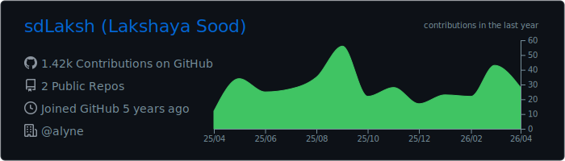
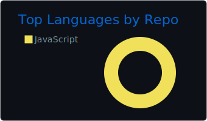
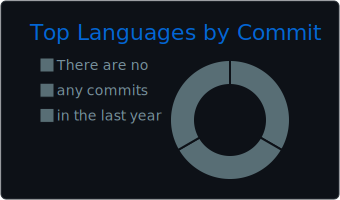
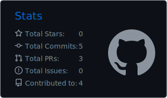
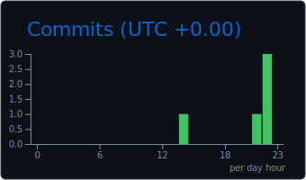

# Hi there, I'm Lakshaya Sood 👋

Welcome to my GitHub profile! I'm a passionate developer working with modern technologies and contributing to various projects.

## 📊 GitHub Statistics

## 🛠️ Technologies & Tools [TBD]

- **Languages**: JavaScript, TypeScript, Python, Go
- **Frontend**: React, Vue.js, HTML5, CSS3
- **Backend**: Node.js, Express
- **Databases**: MongoDB, PostgreSQL
- **Cloud**: AWS, Docker
- **Tools**: Git, VS Code

## 🔗 Connect with me

- 💼 LinkedIn: [Lakshaya Sood](https://www.linkedin.com/in/lakshaya-s-12111983/)
- 📧 Email: lakshaya.sood@alyne.com
- 🌐 Portfolio: [Coming Soon]

## 📈 Contribution Activity

These statistics are automatically updated daily and include both public and private repository contributions to provide a complete picture of my development activity.

---

  <i>⚡ "Code is poetry written in logic" ⚡</i>

  <i>Last updated: Automatically via GitHub Actions</i>

